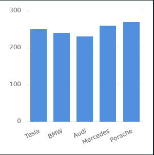

# Quick Start: AG Grid in React

AG Charts is a high-performance JavaScript charting library designed for enterprise applications. It supports a wide range of chart types, including financial, geographic, and interactive charts, and offers features like real-time updates, annotations, and customization. The library integrates seamlessly with AG Grid, making it ideal for data-heavy environments. Regular updates introduce new features such as radial and linear gauges, trend lines, and financial chart enhancements. AG Charts also supports large datasets and is highly customizable.


## 1. Install AG Charts
```bash
npm install ag-charts-react
```
## 2. Import AgCharts
```bash
import React, { useState } from 'react';
import ReactDOM from 'react-dom/client';

// React Chart Component
import { AgCharts } from 'ag-charts-react';
```
## 3. Define Chart Data and Series
```bash 
const CarChartExample = () => {
    // Chart Options: Control and Configuration
    const [chartOptions, setChartOptions] = useState({
        // Data for the graph
        data: [
            { car: 'Tesla', topSpeed: 250, price: 80000 },
            { car: 'BMW', topSpeed: 240, price: 75000 },
            { car: 'Audi', topSpeed: 230, price: 70000 },
            { car: 'Mercedes', topSpeed: 260, price: 85000 },
            { car: 'Porsche', topSpeed: 270, price: 90000 },
        ],
        // Series: Chart Type and Data.
        series: [{ type: 'bar', xKey: 'car', yKey: 'topSpeed' }],
    });

    //insert step 4
};
```
## 4. React Chart Component
```bash
// React Chart Component
  return (
    // AgCharts component with options passed as prop
    <AgCharts options={chartOptions} />
  );
}

// Render component inside root element
const root = ReactDOM.createRoot(document.getElementById('root'));
root.render(<ChartExample />);
```
<p align="center">
    
</p>