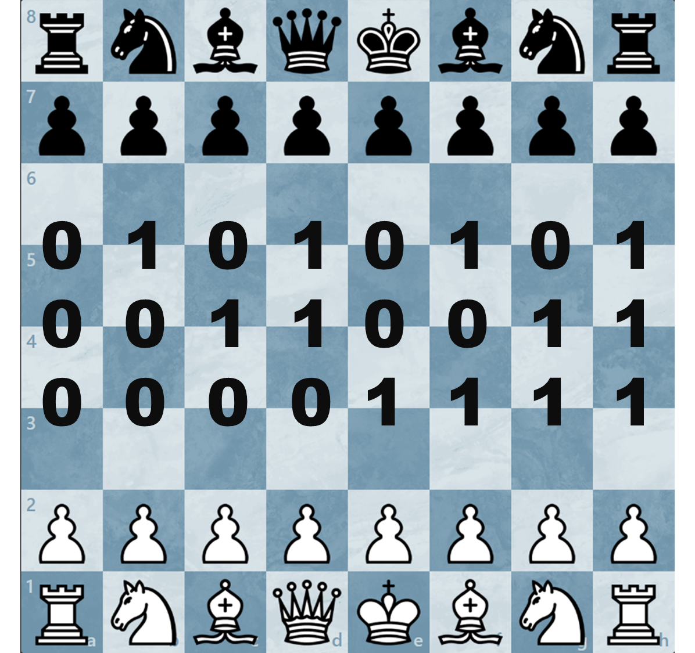

## Storage System Through Chess Game

### Introduction

[chess.com](https://www.chess.com) is the most famous website where you can play chess online. On this website, you can play against real opponents or challenge yourself.

This blog post will show you how to store a file or secret message using a chess game.

### Encryption method

Each file or piece of data is composed of binary (0 and 1). In a chess game, we can link a move to an array of 3 bits.

With this method, each move can store 3 bits.



Checkmate and draws can limit the data length. So if there is a checkmate or a draw, a new game can be started. That game will continue from where the last game left off.

### What Does This Mean in Practice ?

To store the image above, which is `1,262,140 bytes` long, we would need `420,714 moves`, which is a lot.

Now you understand that storing large files is theoretically possible, but it would require a lot of time to encrypt and decrypt the data.

I have found a new potential use for this encryption method.

### CTF Utilisation

Using this method, we can simply and quickly store a flag using a single chess game.

#### Tools

Wintrcat, a talented developer, has created a [tools](https://github.com/WintrCat/chessencryption?tab=readme-ov-file) to automate the encryption and decryption of data using chess games.

I will demonstrate how to use this tool.

##### Installation

First, you will need to install the tool. Use the following command to clone the GitHub repository to your computer.

This will create a folder named `chessencryption`.

```shell
git clone https://github.com/WintrCat/chessencryption.git

cd chessencryption
```

Next, you will need to modify the code slightly. Add these lines at the end of `encode.py`.

```python
# The rest of the code ...

print(encode("flag.txt"))
```

And in `decode.py`, add the following :

```python
# The rest of the code ...

decode("", "output.txt") # replace .txt with the correct extension you want
```

> **Note** : the first parameter will change later ...

#### Testing the Script

Create the file you want to encrypt (`.png`, `.txt`, etc.).
> **Note** : Remember, the larger the file, the more time it will take to encrypt and decrypt.

```shell
┌──(kali㉿kali)-[~/chessencryption]
└─$ echo "IT Trend" > flag.txt
```

Start the script to encrypt your file :

```shell
┌──(kali㉿kali)-[~/chessencryption]
└─$ python3 encode.py
reading file...

encoding file...

successfully converted file to pgn with 1 game(s) (0.005s).
[Event "?"]
[Site "?"]
[Date "????.??.??"]
[Round "?"]
[White "?"]
[Black "?"]
[Result "*"]

1. h3 c6 2. g3 Qa5 3. Bg2 Nh6 4. h4 Qb4 5. Na3 Qb3 6. Nb1 g6 7. axb3 Ng4 8. Bf3 Rg8 9. Na3 *
```

Then, modify `decode.py` again. Replace the empty brackets with the moves from the game.

```shell
┌──(kali㉿kali)-[~/chessencryption]
└─$ nano decode.py 
```
```python
decode("1. h3 c6 2. g3 Qa5 3. Bg2 Nh6 4. h4 Qb4 5. Na3 Qb3 6. Nb1 g6 7. axb3 Ng4 8. Bf3 Rg8 9. Na3 *", "output.txt")
```

Now, you can decrypt your file by running the script :

```shell
┌──(kali㉿kali)-[~/chessencryption]
└─$ python3 decode.py 

successfully decoded pgn with 1 game(s), 17 total move(s)(0.001s).
```

Finally, check the output :

```shell
┌──(kali㉿kali)-[~/chessencryption]
└─$ cat output.txt
IT Trend
```

---

Source 1 : [wintrcat - Storing Files in Chess Games for Free Cloud Storage](https://www.youtube.com/watch?v=TUtafoC4-7k)

Source 2 : [GitHub - chessencryption](https://github.com/WintrCat/chessencryption?tab=readme-ov-file) 