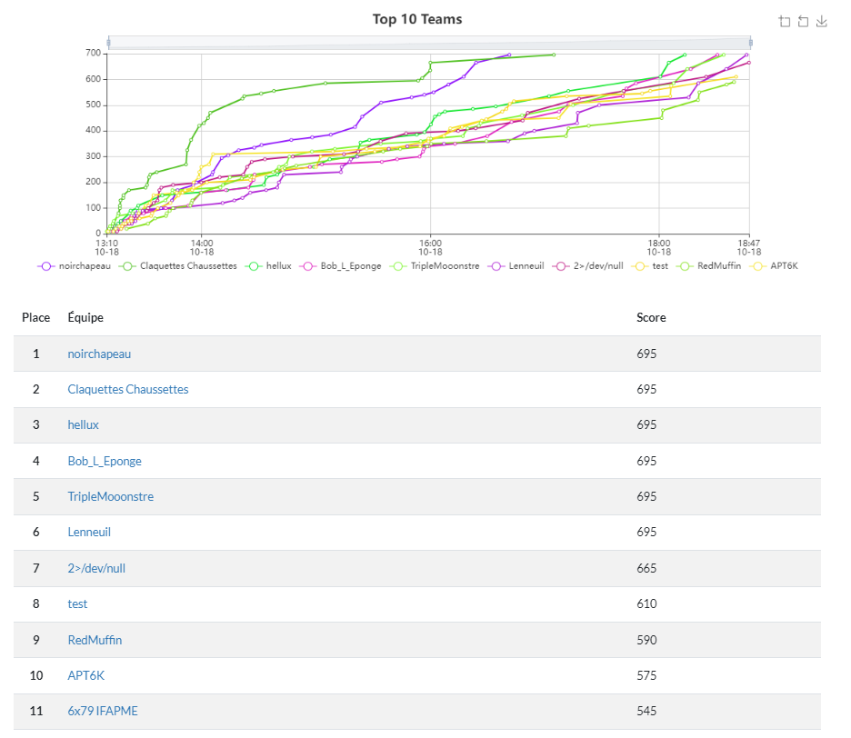

## Cyberweek 2024

### Introduction
Cyberweek 2024 is an event designed to engage future cybersecurity experts through **interactive activities**.

The event encourages participants to challenge their skills, offering a hands-on experience in cybersecurity. It is a great opportunity for *students*, *professionals*, and *enthusiasts* to showcase their talents and learn more about the field

During this blog, I will talk about my experience during the last day of the Cyberweek 2024.

### Events
During the last day, there was many events :

1. **Recruitment Stands :** Meet with recruiters from major companies offering cybersecurity internships, apprenticeships, and job opportunities.

2. **Training Stands :** Explore various cybersecurity training programs for beginners and advanced learners.

3. **Workshops :** Industry experts will cover different careers in cybersecurity, highlighting challenges and career paths.

4. **Capture The Flag (CTF) :** A half-day event where participants solve cybersecurity challenges, with rewards for the leaderboard.

#### Companies featured
1. Nexova Group
2. Wavestone
3. Orange Cyberdefense
4. Approach Cyber
5. Technofutur TIC + Technobel + EECampus
6. Police Judiciare Fédérale + RCCU Charleroi
7. Le Défense CyberCommand Recrutement
8. La Défense Composante "Cyber Security F-35"
9. MCG Consulting
10. CMIB4Talent
11. NVISO

#### Workshop : Working in cybersecurity in industry
Presented by [Grégorio Matias](https://www.linkedin.com/in/gregorio-matias-009bab49/) working for [MCG Consulting](https://www.mcg.be).

During the workshop, Gregorio Matias showed us the importance of cyber security in the industrial sector.
To give just one example, he told us about a cyber attack that took place in Iran in 2010, organised by the United States and Israel. This attack could have resulted in an unconscionable number of deaths.

On top of that, I learned that industrial machines in factories are not secure. Being very old, cyber security standards were very low. What's more, just a one-day shutdown to fix these problems could cost a company several million euros.

That's why, according to Gregorio Mathias and all the statistics he has shown us, cyber security in the industrial sector is an important issue.

#### CTF
The most important part of the day (imo) was the CTF organised by [Redsystem](redsystem.io).

During this ctf, everyone learned. Whether in technical or social knowledge.

HELB came out in force and one of their teams finished on the podium.
Here is the final rankings.

| Place         | Team              | Score | Member                                            | Price     |
| :---:         | :---:             | :---: | :---:                                             | :--:      |
| 3             | hellux            | 695   | Damian - Jeremy - Imaddine + 2                    | 100€ HTB  |
| 4             | Bob_L_Eponge      | 695   | Khalid - Friedrich - Anas - Imrane - Zakaria      | /         |
| 5             | TripleMooonstre   | 695   | Clement - Romain - Chakir - Ismail - Sebastien    | /         |
| 6             | Lenneuil          | 695   | Lenny - Nathan - John - Elie + 1                  | /         |

---
Source 1 : [Wikipedia - Stuxnet](https://fr.wikipedia.org/wiki/Stuxnet)

Source 2 : [eventbrite - Cyberweek 2024](https://www.eventbrite.fr/e/cyberweek-2024-les-futurs-experts-en-cybersecurite-a-vous-de-jouer-tickets-979926214687)

Source 3 : [Linkedin - Friedrich Post](https://www.linkedin.com/feed/update/urn:li:activity:7253123652605341696/)